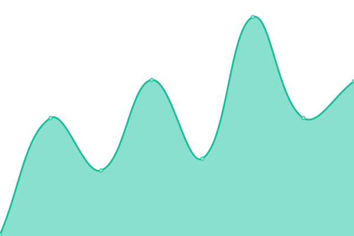

# [📈 Live Status](https://Rendiok.github.io/upptime): <!--live status--> **🟧 Partial outage**

This repository contains the open-source uptime monitor and status page for [Rendiok](https://Rendiok.github.io/upptime), powered by [Upptime](https://github.com/upptime/upptime).

With [Upptime](https://upptime.js.org), you can get your own unlimited and free uptime monitor and status page, powered entirely by a GitHub repository. We use [Issues](https://github.com/Rendiok/upptime/issues) as incident reports, [Actions](https://github.com/Rendiok/upptime/actions) as uptime monitors, and [Pages](https://Rendiok.github.io/upptime) for the status page.

<!--start: status pages-->
<!-- This summary is generated by Upptime (https://github.com/upptime/upptime) -->
<!-- Do not edit this manually, your changes will be overwritten -->
<!-- prettier-ignore -->
| URL | Status | History | Response Time | Uptime |
| --- | ------ | ------- | ------------- | ------ |
|  [API](https://api.forcemanager.com) | 🟥 Down | [api.yml](https://github.com/rendiok/fm-test/commits/HEAD/history/api.yml) | 

 415ms
     
 | 

<a href="https://Rendiok.github.io/fm-test/history/api">0.26%</a>
    

|  [APP](https://app.forcemanager.net) | 🟩 Up | [app.yml](https://github.com/rendiok/fm-test/commits/HEAD/history/app.yml) | 

 564ms
     
 | 

<a href="https://Rendiok.github.io/fm-test/history/app">100.00%</a>
    

|  [BE-PRO](https://be-pro.forcemanager.net/healthcheck.ashx) | 🟩 Up | [be-pro.yml](https://github.com/rendiok/fm-test/commits/HEAD/history/be-pro.yml) | 

 519ms
     
 | 

<a href="https://Rendiok.github.io/fm-test/history/be-pro">100.00%</a>
    

<!--end: status pages-->

[**Visit our status website →**](https://Rendiok.github.io/fm-test)

## 📄 License

- Powered by: [Upptime](https://github.com/upptime/upptime)
- Code: [MIT](./LICENSE) © [Rendiok](https://Rendiok.github.io/upptime)
- Data in the `./history` directory: [Open Database License](https://opendatacommons.org/licenses/odbl/1-0/)
